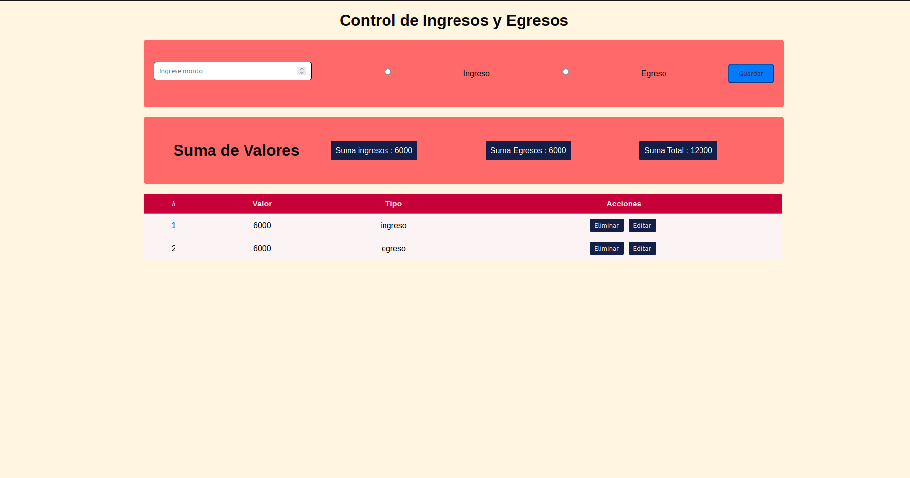
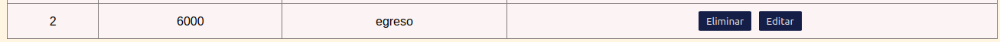
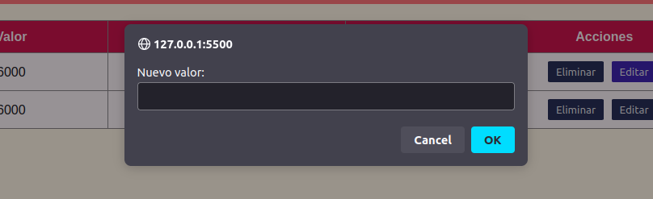
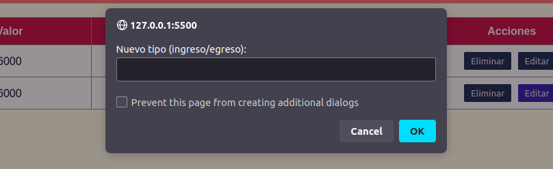

# Presupuestos 
A partir de este proyecto podemos identificar el consumo de API'S, su primera etapa enviaba su informacion a una API no local como MOCKAPI, en su segunda etapa se configuro un JSON.SERVER para guardad y mostrar dicha informacion en un server local. 
# Objetivo 
Este taller se hizo con el proposito de conocer respecto al crud de JavaScript utilizando el API denominado mockapi.
A partir de esto se genero una informacion que se debia guardar, mostrar en la pagina adema de tener opciones de eliminar y editar el archivo. 
Luego realizamos un cambio en la api para utilizar una local, configuramos el JSON.server y sus determinados package.json y db.json para guardar la informacion.

# Tecnologia utilizada
* JavaScript
* HTML
* CSS
* Mockapi 
* JSON server 
# Contribuciones de la comunidad 

Si deseas hacer una contribucion generalizada a este repositorio, no dudes en hacerlo, estoy entusiasmado de poder recibir ayuda y tips para mejorar mi codigo y en general ser un mejor programador!!

# Contenido del repositorio 

+ `index.html` : Esta es la vista del script para visualizar el proyecto 
+ `style.css` : Esta carga los estilos utilziados en mi script HTML 
+ `main.js` : Este es el script principal del cual depende mi aplicacion para el correcto funcionamiento de la misma. 
+ `.gitignore`: La funcion de esta es poder esconder las carpetas node_modules y package-lock.json, el proposito de esconderlas es que contienen mucha informacion y github no cuenta con el soporte para subirla si deseas clonar este repositorio no olvides utilizar la funcion `npm i` para vovler a mostrar estas carpetas 
+ `db.json` : Es donde se guarda la informacion en formato Json 
+ `image;1`: Imagenes que se utilizan para un formato de visualizacion mejor en el readme 
# API utilizada 
Primera etapa: 
`https://mockapi.io/projects/6509d0e4f6553137159c123f`    
Segunda etapa y actual: 
`http://127.0.0.2:5010/users`
## Visualizacion del formato 

Vinculo pagina: https://barbatoslopux.github.io/presupuesto/

### Si desea editar una valor: 
Das en el valor editar: 

Aca ingresas el valor deseado para valor: 
 y presionas ok
Aca escribes si es un ingreso o un egreso: 

Y listo el valor se editara correctamente. 

Si deseas eliminar basta no mas con darle en el boton de eliminar y automaticamente eliminas la casilla seleccionada. 

## por: Kevin Sneider Esteban Merchan
