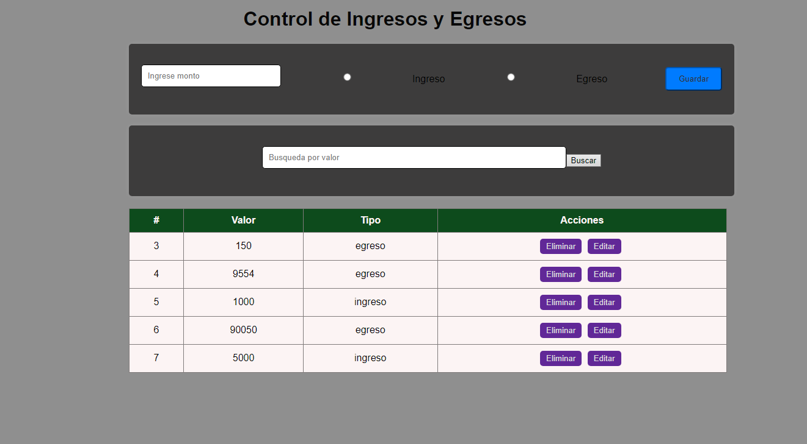

# Presupuestos 

Este taller se hizo con el proposito de conocer respecto al crud de JavaScript utilizando el API denominado mockapi.
A partir de esto se genero una informacion que se debia guardar, mostrar en la pagina adema de tener opciones de eliminar y editar el archivo. 

Se utilizo:
* JavaScript
* HTML
* CSS
* Mockapi 

## Visualizacion del formato 

## por: Kevin Sneider Esteban Merchan